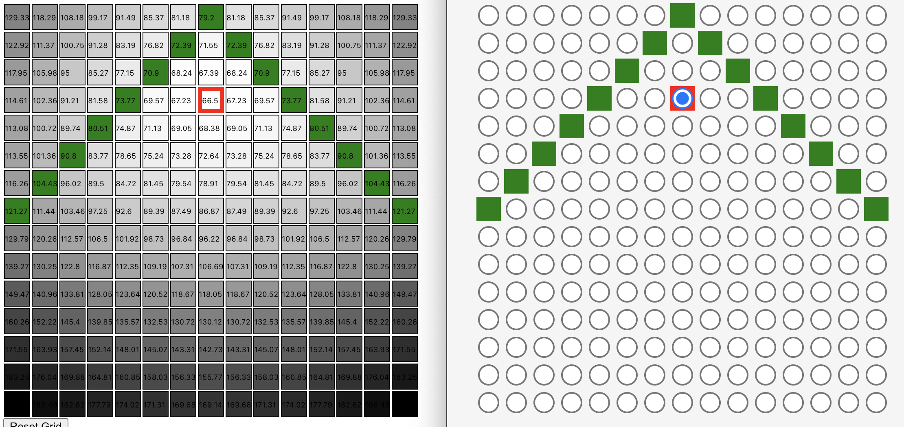

# iq-distance
This is an interactive solver for the `Central Point` subtest of the [FSIQ test](https://openpsychometrics.org/tests/FSIQ/1.php). The description for this section of the test reads as follows:

> In this task you will be given a grid with some points shaded in green. You will need to select the point that is most in the middle of all of them. The one that has the lowest average distance from it to each of the green points.
> For example, in the grid below, what point is closest to all three green points at the same time?
> 
> 
> 
> Two possible answers are below. Blue lines have been added to show how good each is.
> 
>  
> 
> The total length of the blue lines on the left is 11 and it is 12.4 on the right, so the one on the left is the best answer of these two (it is also the best possible in this case).
> You do not have to select the perfect answer, you will get partial credit for answers that are close.

While it is true that the above example is solved by their first possible answer (on the left), their displayed values are incorrect. The correct values are shown here:

Given this confusion, plus my own curiosity of how different patterns would change the central point, I created this sandbox.

## Live version
This is hosted on github pages [here](http://pabo.github.io/iq-distance)
## Comparisons
Below are the comparisons between my sandbox and their given answers, all of which match up.

